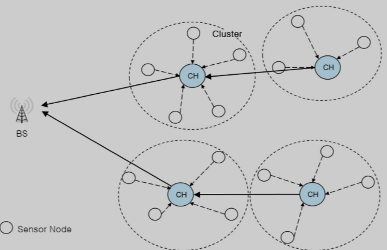
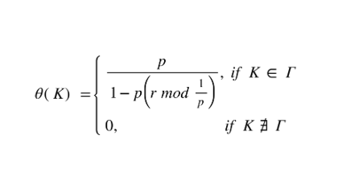

## Low Energy Adaptive Clustering Hierarchy (LEACH): 

LEACH is one of the most popular clustering algorithms for Wireless Sensor Network (WSN).
It forms clusters based on the received signal strength and uses the Cluster Head (CH) nodes as gateways to the BS. 
All the data processing such as data fusion and aggregation are locally performed within the cluster.

 LEACH forms clusters by using a distributed algorithm, where nodes make autonomous decisions without any centralised control. 

Initially a node decides to be a CH with a probability p and broadcasts its decision. 

Each non-CH node determines its cluster by choosing the CH that can be reached using the least communication energy. 

The role of being a CH is rotated periodically among the nodes of the cluster in order to balance the load. 
The rotation is performed by getting each node K to choose a random number between 0 and 1. 
Taken from the paper "LEATCH: Low Energy Adaptive Tier Clustering Hierarchy"
![from the paper][https://core.ac.uk/download/pdf/82600413.pdf]

A node K becomes a CH for the current rotation round if the number θ (Κ) is less than the following threshold:

## Installation